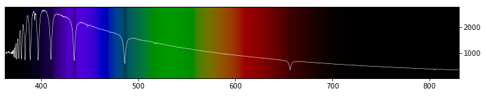

# SDSS DR-17 star spectra

This repository investigates [SDSS DR-17 MaStar](https://www.sdss.org/dr17/mastar) dataset of star spectra for the purposes of exploring statistical learning topics: AutoML, regression, and PCA. Also, I ❤️ astronomy!

Start reading with the [exploration notebook](./01_explore.ipynb), and find out what mysterious and special star we have stumbled upon when browsing through the bad regression results 😊 ⭐